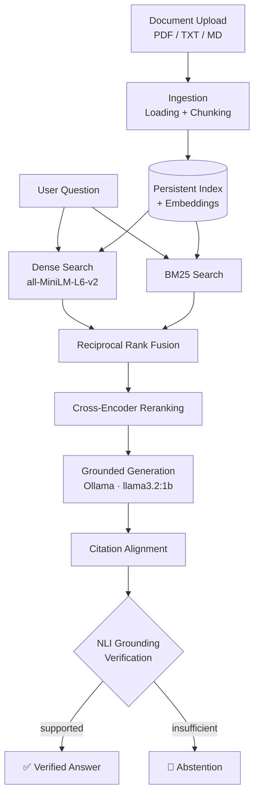

<div align="center">

# EvidenceRAG

**Retrieve evidence first. Generate from it. Verify before answering.**

A local-first document intelligence platform that answers questions from your own documents using hybrid retrieval, cross-encoder reranking, grounded generation, citation alignment, and NLI-based verification, and abstains when the evidence isn't enough.


[Features](#-features) · [Architecture](#-architecture) · [Quick Start](#-quick-start) · [API](#-api) · [Evaluation](#-evaluation) · [Limitations](#-limitations)

</div>

---

<!--
  Add a screenshot or GIF of the streaming UI here. Example:
  
-->

## Why EvidenceRAG?

Most RAG demos make a single LLM call and hope the answer is grounded. EvidenceRAG treats generation as **untrusted** and puts a verification step between the model and the user.

| Principle | What it means |
|---|---|
| **Evidence before generation** | Relevant passages are retrieved and ranked before the LLM sees anything. |
| **Generation is not verification** | Every cited claim is checked against its evidence before the answer is returned. |
| **Abstention over unsupported claims** | If the evidence can't support an answer, the system says so instead of guessing. |
| **Reproducible evaluation** | Retrieval changes are measured on a controlled benchmark, not just eyeballed. |
| **Incremental indexing** | Unchanged documents are never re-embedded. |
| **Local-first** | Generation and verification run on your machine, with no external LLM API needed. |

---

## ✨ Features

- **Hybrid retrieval**: dense search (`all-MiniLM-L6-v2`) plus BM25, merged with Reciprocal Rank Fusion, so both semantic questions and exact identifiers work.
- **Cross-encoder reranking**: a second relevance stage using `cross-encoder/ms-marco-MiniLM-L-6-v2`.
- **Persistent, incremental index**: SHA-256 fingerprints detect changes; only new or modified documents are re-indexed, and deleted ones are removed.
- **Grounded generation**: a local Ollama model (`llama3.2:1b`) receives only retrieved evidence and is instructed to avoid outside knowledge and to abstain when evidence is insufficient.
- **Citation alignment**: claims are normalized into `[Evidence 1]`, `[Evidence 2]` style citations that map to the exact passages shown in the UI.
- **Grounding verification**: NLI (`cross-encoder/nli-MiniLM2-L6-H768`) as the primary signal, with a strict lexical-overlap fallback for near-verbatim evidence.
- **Streaming UX**: Server-Sent Events deliver retrieval stages, sources, tokens, and verification status progressively.
- **Multi-format ingestion**: PDF, TXT, and Markdown.

---

## 🏗 Architecture



### Pipeline stages

| # | Stage | Purpose |
|---|---|---|
| 1 | Ingest & chunk | Load PDF/TXT/MD and split into retrievable passages |
| 2 | Index | Persist chunks, metadata, and embedding matrices; track SHA-256 fingerprints |
| 3 | Dense + BM25 retrieval | Capture semantic similarity and exact-term matches |
| 4 | Reciprocal Rank Fusion | Combine both ranked lists into one candidate set |
| 5 | Cross-encoder rerank | Re-score candidates for a precise final ordering |
| 6 | Grounded generation | Answer using only the supplied evidence |
| 7 | Citation alignment | Attach `[Evidence N]` citations to factual claims |
| 8 | Verification | NLI with lexical fallback; abstain if unsupported |

---

## 🧰 Tech Stack

| Layer | Technologies |
|---|---|
| **Frontend** | React, TypeScript, Vite, CSS, Server-Sent Events |
| **Backend** | Python, FastAPI, Pydantic, Pytest |
| **Retrieval** | Sentence Transformers, `all-MiniLM-L6-v2`, BM25, RRF, `cross-encoder/ms-marco-MiniLM-L-6-v2` |
| **Generation** | Ollama, `llama3.2:1b` |
| **Verification** | NLI (`cross-encoder/nli-MiniLM2-L6-H768`), lexical-support fallback |
| **Storage** | NumPy, SHA-256 fingerprints, JSON metadata, persisted embedding matrices |

---

## 🚀 Quick Start

### Prerequisites

- Python 3.10+
- Node.js 18+
- [Ollama](https://ollama.com/download)

### 1. Clone the repository

```bash
git clone https://github.com/Sahil-u07/evidencerag.git
cd evidencerag
```

### 2. Configure environment

```bash
cp .env.example .env      # Windows PowerShell: Copy-Item .env.example .env
```

### 3. Pull the local model

```bash
ollama pull llama3.2:1b
ollama list              # confirm it appears
```

### 4. Start the backend

<details open>
<summary><b>Windows (PowerShell)</b></summary>

```powershell
cd backend
python -m venv .venv
.\.venv\Scripts\Activate.ps1
pip install -r requirements.txt
uvicorn app.main:app --reload
```
</details>

<details>
<summary><b>macOS / Linux</b></summary>

```bash
cd backend
python -m venv .venv
source .venv/bin/activate
pip install -r requirements.txt
uvicorn app.main:app --reload
```
</details>

| URL | Description |
|---|---|
| `http://127.0.0.1:8000` | API |
| `http://127.0.0.1:8000/docs` | Interactive Swagger docs |

### 5. Start the frontend

```bash
cd frontend
npm install
npm run dev
```

Open **http://localhost:5173**, upload a document, and ask a question.

---

## 🔌 API

| Method | Endpoint | Description |
|---|---|---|
| `GET` | `/health` | Backend readiness and the configured generation model |
| `POST` | `/search` | Retrieval only (hybrid + rerank), no generation |
| `POST` | `/query/stream` | Full pipeline as a Server-Sent Events stream |
| `POST` | `/documents/upload` | Upload a PDF, TXT, or MD file |
| `GET` | `/documents` | List indexed documents |
| `DELETE` | `/documents/{filename}` | Remove a document from the index |

### Search

```bash
curl -X POST http://127.0.0.1:8000/search \
  -H "Content-Type: application/json" \
  -d '{"query": "What is BM25?", "top_k": 5}'
```

### Streaming query

```bash
curl -N -X POST http://127.0.0.1:8000/query/stream \
  -H "Content-Type: application/json" \
  -d '{"query": "What is BM25?", "top_k": 5}'
```

The stream emits these event types in order as the answer is produced:

| Event | Meaning |
|---|---|
| `stage` | Pipeline progress (retrieval, generation, verification) |
| `sources` | Retrieved evidence passages |
| `token` | Incremental generated text |
| `verification` | Grounding verification result |
| `final` | The final answer (verified, or an abstention) |
| `done` | End of stream |

> Use the interactive docs at `/docs` to try uploads and inspect the exact request and response schemas.

---

## 📊 Evaluation

Retrieval and reranking are evaluated on a controlled 20-question benchmark included in the repository (`data/evaluation/`), so changes can be measured reproducibly.

**Metrics:** Recall@1, Recall@3, Recall@5, Mean Reciprocal Rank (MRR), nDCG@5.

| Retriever | Recall@1 | Recall@3 | Recall@5 | MRR | nDCG@5 |
|---|---:|---:|---:|---:|---:|
| Dense | 0.600 | **1.000** | **1.000** | 0.975 | **0.974** |
| BM25 | 0.550 | 0.875 | 0.925 | 0.925 | 0.885 |
| Hybrid (RRF) | 0.600 | 0.900 | 0.975 | 0.975 | 0.936 |
| **Reranked Hybrid** | **0.650** | 0.975 | 0.975 | **1.000** | 0.973 |

**Reading the results honestly:**

- The cross-encoder gives the best top-1 precision (Recall@1 and MRR), which matters most because the top passages feed generation.
- Dense retrieval is already very strong on this small, clean corpus, so hybrid fusion doesn't beat it here. BM25's value shows up on exact terms and technical identifiers, which this benchmark only lightly exercises.
- With only 20 questions, differences of a few points are within noise. Treat this as a regression harness rather than a leaderboard.

### Latency (local, warm run)

Measured on the development machine with CPU-only inference and `llama3.2:1b`:

| Stage | Time |
|---|---:|
| Retrieval | ~1.0 s |
| Generation | ~2.8 s |
| Verification | ~0.1 s |
| **Total** | **~3.9 s** |

These are environment-dependent development benchmarks, not production latency guarantees.

---

## 🧪 Testing

```powershell
# Backend (from /backend)
.\.venv\Scripts\python.exe -m pytest -q        # Windows
python -m pytest -q                            # macOS / Linux, venv active
```

Current suite: **97 passed**.

```bash
# Frontend production build (from /frontend)
npm run build
```

---

## 📁 Repository Structure

```text
evidencerag/
├── backend/
│   ├── app/
│   │   ├── core/          # configuration and shared utilities
│   │   ├── evaluation/    # retrieval benchmark and metrics
│   │   ├── generation/    # grounded generation and citations
│   │   ├── ingestion/     # loading, chunking, indexing
│   │   ├── reranking/     # cross-encoder reranker
│   │   └── retrieval/     # dense, BM25, and RRF fusion
│   ├── scripts/
│   └── tests/
├── frontend/
│   └── src/               # React + TypeScript streaming UI
├── data/
│   ├── evaluation/        # benchmark questions
│   ├── index/             # persisted index (generated)
│   └── uploads/           # uploaded documents (generated)
├── docs/
├── screenshots/
├── .env.example
├── LICENSE
└── README.md
```

---

## ⚠️ Limitations

EvidenceRAG is a research-oriented engineering project, and it's upfront about what it doesn't do:

- **Small local generator.** `llama3.2:1b` is chosen for lightweight CPU inference, so answer quality and latency vary with hardware and question difficulty.
- **NLI is a signal, not a proof.** Grounding verification reduces unsupported claims but is not a mathematical guarantee of factual correctness.
- **Small evaluation corpus.** The benchmark is controlled and much smaller than real production document collections.

---

## 🗺 Roadmap

- [ ] Screenshots and demo GIF
- [ ] Optional larger or remote generation backends
- [ ] Larger, more diverse evaluation corpus
- [ ] End-to-end answer-quality and faithfulness evaluation
- [ ] CI pipeline for tests and frontend build

---

## 🤝 Contributing

Issues and pull requests are welcome. Please run the backend test suite and the frontend build before opening a PR.

## 📄 License

Released under the [MIT License](LICENSE).

---

<div align="center">

Built by [Sahil](https://github.com/Sahil-u07)

</div>